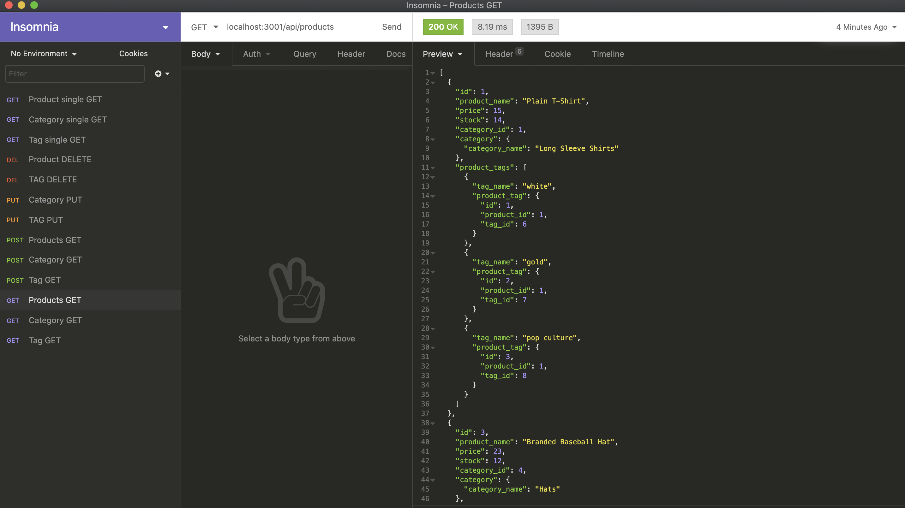

# E-Commerce Backend

## Description
This is a full back end application that incorperates MySQL and Sequlize to support the database of an online retailer. Server users have the ability to create, read, update, and delete contents of the database

## Table of Contents
* [Installation](#installation)
* [Usage](#usage)
* [License](#license)
* [Contribution](#contribution)
* [Test](#test)
* [Questions](#questions)

## Installation
Clone repository from (https://github.com/ginomaglaqueucla/e-commerce-backend-gm20.git) to local directory on computer.
1. Download/Obtain source code locally from GitHub Repository
2. Open terminal or gitbash command line, Change Directory (cd) to location of working directory
3. Enter `npm install`, to download dependicies
4. Enter `npm start`

## Usage
- Using "localhost:3001/api/" as the prefix
- Enter desired action
- Observe changes to the databases

## License

MIT License

Copyright (c) [2020] [Gino Maglaque]

Permission is hereby granted, free of charge, to any person obtaining a copy of this software and associated documentation files (the "Software"), to deal in the Software without restriction, including without limitation the rights to use, copy, modify, merge, publish, distribute, sublicense, and/or sell copies of the Software, and to permit persons to whom the Software is furnished to do so, subject to the following conditions:

The above copyright notice and this permission notice shall be included in all copies or substantial portions of the Software.

## Contribution
This project uses the following external: 
- npm express
- npm sequelize
- npm MySQL2

To contribute to this project:
1. Clone repository from Installation section
2. Pull latest code locally, Create new working branch
3. Push up newly created branch
4. Create Pull Request and add reviewers when ready to merge with main code

## Test

View tutorial video here: [E-Commerce Backend Demo](https://drive.google.com/file/d/1WOmgdyvNxCuzoy4KmDaXu1sObjAdXKJ-/view)

## Questions
Any questions? Contact at: ginomaglaque@gmail.com

GitHub: [ginomaglaqueucla](https://github.com/ginomaglaqueucla)